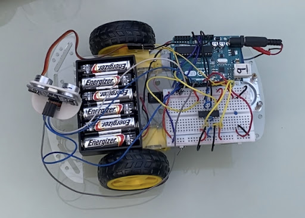

# Obstacle Avoiding Car using Arduino Uno

**Disclaimer:** This project was completed as a part of my Computer Engineering (TEJ3M0) class in June of 2023.

This project demonstrates the construction of an obstacle-avoiding car using an Arduino Uno. The car is equipped with an ultrasonic sensor that helps it detect obstacles in its path and navigate around them.

## Table of Contents
- [Features](#features)
- [Components](#components)
- [Circuit Diagram](#circuit-diagram)
- [Installation](#installation)
- [Usage](#usage)
- [Future Plans](#future-plans)
- [Contributing](#contributing)
- [License](#license)

## Features
- Autonomous obstacle avoidance using ultrasonic sensors.
- Simple and straightforward circuitry and code.
- Adjustable sensor sensitivity and car behavior parameters.
- **Piezo buzzer** and **LED indicator** added post-project completion.
- Well-documented code for easy understanding and modification.

## Components
- Arduino Uno board
- Chassis and wheels
- Motor driver module (L293D)
- Ultrasonic distance sensors (HC-SR04)
- Wheels and DC motors
- Power source (battery pack)
- Jumper wires
- **Piezo buzzer**
- **LED**
- Servo motor
- Breadboard
- **3D printed parts** (custom parts to integrate components)

## Circuit Diagram

The circuit diagram shows how the components are connected to the Arduino Uno and motor driver module. The **LED** is visible in the image, but it was added later along with the **piezo buzzer**. Make sure to connect everything correctly to ensure the car functions as intended.

## Installation
1. Clone this repository to your local machine: `git@github.com:kabirvirk51/obstacle-avoiding-car.git`
2. Upload the Arduino sketch (`obstacle-avoiding-car.ino`) to your Arduino Uno using the Arduino IDE.
3. Make the necessary connections as shown in the circuit diagram.

## Usage
To operate the obstacle-avoiding car, follow these steps:

1. Power on the car by connecting the battery pack.
2. Place the car in an area with obstacles, ensuring enough space for movement.

When the car is powered on:
1. The car will autonomously start moving forward.
2. As it moves, the ultrasonic distance sensors will continuously monitor its surroundings.

When the car detects an obstacle:
1. It will immediately halt its forward movement.
2. The **LED** indicator will illuminate, providing a visual indication of obstacle detection.
3. Simultaneously, the **piezo buzzer** will emit a sound to alert the user.

The obstacle-avoidance routine:
1. The car will initiate a reverse movement to create distance from the detected obstacle.
2. While reversing, the **LED** and **buzzer** will remain active.
3. The servo motor will activate, moving the ultrasonic sensor to scan the area left and right.
4. Based on the sensor's input, the car will determine the optimal direction to avoid the obstacle.
5. Once the direction is determined, the car will turn its wheels accordingly.
6. After turning, the car will resume its forward movement, navigating around the detected obstacle.

To fine-tune the car's performance:
- Access the code and adjust sensor sensitivity, movement duration, and turning angles as needed.
- Experiment with different values to optimize the car's responsiveness to obstacles and its navigation.

Remember, the integration of the **3D printed parts** contributes to the car's ability to function as a cohesive unit, allowing it to effectively detect obstacles, respond, and navigate through its environment.

Enjoy experimenting with your obstacle-avoiding car and exploring its autonomous and interactive features!

## Future Plans
The project's future plans include:
- Integrate a **joystick module** for manual control.
- Implement **RF (Radio Frequency) modules** for wireless remote control.

## Contributing
Contributions to this project are welcome! Feel free to open issues and pull requests to suggest improvements, report bugs, or add new features.

## License
This project is licensed under the [MIT License](LICENSE).

---

Happy tinkering with your obstacle-avoiding car! If you have any questions or run into issues, please feel free to [contact me](kabirvirk91@gmail.com).
